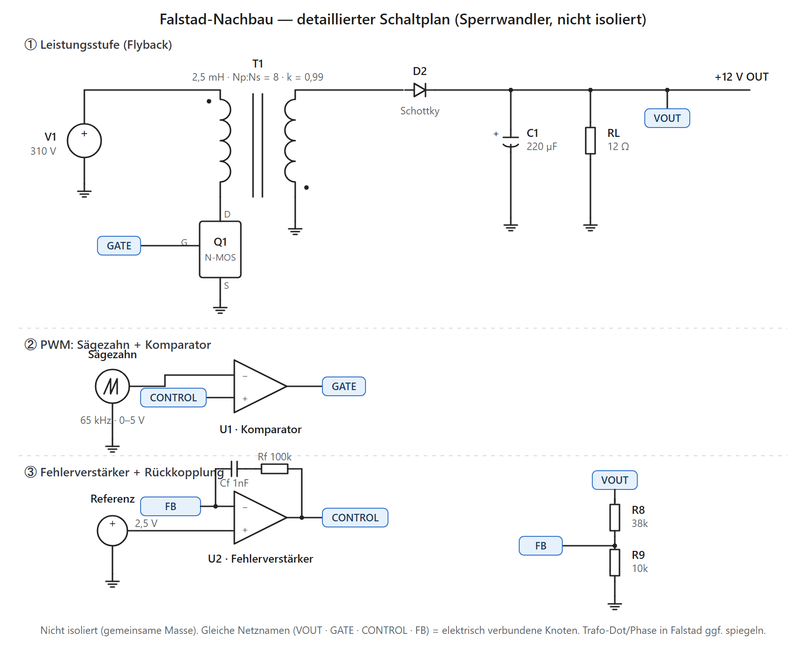
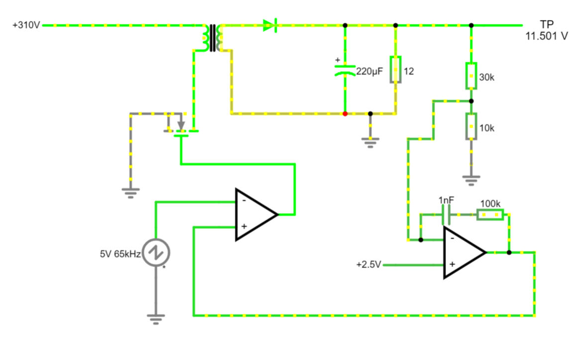

# Den Sperrwandler in Falstad simulieren (vereinfacht)

*Schritt für Schritt zu einer animierten, geregelten Flyback‑Schaltung im Browser — ein Werkstattbericht (Simulations‑Teil)*

> **Kurzfassung:** Mit dem kostenlosen **Falstad CircuitJS** (läuft im Browser, keine Installation) lässt sich das Prinzip des Netzteils anschaulich nachbauen: Zwischenkreis → Schalter → Trafo → Gleichrichtung → **geschlossener Regelkreis**. Den OB2263 ersetzen wir durch einen kleinen PWM‑Erzeuger + Fehlerverstärker (gleiche Wirkung). Am Ende siehst du den Strom fließen und kannst live an Last und Eingangsspannung drehen — genau wie im Lern‑Widget.

---

## 🧭 Warum Falstad — und was es kann/nicht kann

- ✅ **Sofort startklar:** [falstad.com/circuit](https://www.falstad.com/circuit/) im Browser öffnen, fertig. Es gibt auch eine Desktop‑Version.
- ✅ **Animierter Stromfluss** — ideal fürs Verstehen von Gleichrichtung, Trafo und Rückkopplung.
- ⚠️ **Kein OB2263‑Modell** (gibt es nirgends frei). Wir bauen seine *Architektur* nach: Sägezahn + Komparator = PWM, Op‑Amp = Fehlerverstärker.
- ⚠️ **Vereinfachte Trennung:** Für die Anschauung lassen wir TL431 + Optokoppler weg und regeln mit **einem** Op‑Amp auf gemeinsamer Masse. Das zeigt das Regelverhalten korrekt — nur eben ohne galvanische Trennung. (Erweiterung siehe unten.)

---

## ⚙️ Vorbereitung (wichtig!)

Ein Schaltnetzteil taktet mit ~65 kHz. Damit Falstad das sauber rechnet:

1. Menü **Options → Other Options**: **Time step size** auf ca. **`1e-7` … `2e-7` s** stellen (Standard 5e‑6 ist viel zu grob → unbrauchbar).
2. Oben den Regler **Simulation Speed** langsam stellen, um die Vorgänge zu beobachten.
3. Menü **Scopes**: Später Messpunkte hinzufügen (Rechtsklick auf Bauteil → *View in Scope*).

---

## 🗺️ Detaillierter Schaltplan (zum Nachbauen)

Dieser Plan zeigt jeden Knoten. **Gleiche Netznamen** (`VOUT`, `GATE`, `CONTROL`, `FB`) sind in Falstad **derselbe Knoten** — du kannst sie entweder direkt verdrahten oder in Falstad als *Labeled Node* (`Draw → Outputs and Labels → Add Labeled Node`) gleich benennen. Die Schaltung ist **nicht isoliert** (eine gemeinsame Masse).

### Verdrahtungs-Checkliste (Knoten für Knoten)

| Knoten | Verbindet |
|---|---|
| **VIN** | V1 (+) · T1 Primär oben |
| **DRAIN** | T1 Primär unten · Q1 Drain · (Snubber optional) |
| **GATE** | Q1 Gate · Komparator‑Ausgang (U1) |
| **RAMP** | Sägezahn‑Quelle · Komparator **−**‑Eingang (U1) |
| **CONTROL** | Fehlerverstärker‑Ausgang (U2) · Komparator **+**‑Eingang (U1) |
| **SEK** | T1 Sekundär · D2 Anode |
| **VOUT** | D2 Kathode · C1 (+) · RL · R8 (oben) |
| **FB** | R8/R9‑Mittelabgriff · U2 **−**‑Eingang · RC‑Glied (Rf/Cf) |
| **REF** | 2,5‑V‑Quelle · U2 **+**‑Eingang |
| **GND** | V1 (−) · Q1 Source · T1 Sekundär (andere Seite) · C1/RL (−) · R9 · alle Quellen‑Massen |

> 💡 **Reihenfolge, die selten hakt:** erst die **Leistungsstufe** (V1 → T1 → Q1 → D2 → C1/RL) aufbauen und mit einer festen Gate‑Rechteckquelle testen (schaltet der MOSFET, kommt Spannung raus?). Dann **U1 + Sägezahn** dranhängen (PWM steht). Zuletzt **U2 + Teiler + Referenz** — jetzt schließt sich der Regelkreis.

---

## 🛠️ Der Aufbau in 7 Schritten

Bauteile kommen aus dem **Draw**‑Menü (Kategorien heißen je nach Version leicht anders). Werte per **Rechtsklick → Edit** einstellen.

**① Zwischenkreis (die „~310 V")**
- `Draw → Inputs and Sources → Add Var Rail` (einstellbare DC‑Quelle). Wert **310 V**. Der Schieberegler dieser Quelle wird später dein „Netzspannungs"-Regler.
- `Add Ground` als Bezugsmasse.

**② Sperrwandler‑Trafo**
- `Draw → Passive Components → Add Transformer`.
- Rechtsklick → Edit: **Primary Inductance ≈ 2,5 mH**, **Turns Ratio (Np:Ns) ≈ 8**, **Coupling Coefficient 0,99**.
- Primär‑oben an **+310 V**.

**③ Schalttransistor (statt Q1)**
- `Draw → Active Components → Add MOSFET (N‑Channel)`.
- **Drain** an Primär‑unten, **Source** an Masse, **Gate** kommt später vom PWM (Schritt ⑤).

**④ Sekundär‑Gleichrichtung**
- `Add Diode` von der Sekundärwicklung zum Ausgangsknoten (**+12 V**).
- `Add Capacitor` **220 µF** vom Ausgang zur Sekundärmasse.
- `Add Resistor` **12 Ω** als Grundlast (≈ 1 A). Optional einen `Add Switch` mit zweitem Lastwiderstand für den „Lastsprung".
- 🔎 *Dot‑Test:* Leitet die Diode schon in der **Einschaltphase**, ist die Wicklung falsch herum — dann die **beiden Sekundär‑Anschlüsse tauschen** (Flyback ⇒ Diode leitet in der Ausschaltphase).

**⑤ PWM erzeugen (statt Oszillator im OB2263)**
- `Add A/C Voltage Source` → Edit: **Waveform = Sawtooth**, **Frequency = 65k**, Amplitude/Offset so, dass sie **0…5 V** rampt.
- `Add Op Amp` als **Komparator**: **−**‑Eingang = Sägezahn, **+**‑Eingang = Regelspannung (aus ⑥), **Ausgang → Gate** des MOSFET. So gilt: Regelspannung hoch ⇒ Tastverhältnis groß.

**⑥ Rückkopplung / Fehlerverstärker (statt TL431 + Opto)**
- Teiler **R8 = 38 kΩ** (oben, von +12 V) und **R9 = 10 kΩ** (unten, zur Masse). Mittelabgriff = Istwert.
- Referenz **2,5 V**: eigener `Add Var Rail` (2,5 V) oder Zenerdiode.
- `Add Op Amp` als **Fehlerverstärker**: **−**‑Eingang = Istwert (Teiler), **+**‑Eingang = 2,5 V, **Ausgang = Regelspannung** → an den +‑Eingang des Komparators (⑤).
- Zur Stabilität ein **RC‑Glied** (z. B. 100 kΩ + 1 nF) vom Op‑Amp‑Ausgang zurück auf den −‑Eingang (macht ihn zum PI‑Regler).
- 🔑 Vorzeichen: Steigt U_out → Istwert steigt → (invertierender Eingang) Regelspannung sinkt → Duty sinkt → U_out sinkt. **Gegenkopplung.** Ausgangsspannung stellt sich auf `U_out = 2,5 V × (1 + R8/R9) = 2,5 × 4,8 = 12 V` ein.

**⑦ Messen & Ausprobieren**
- Rechtsklick → *View in Scope* auf: **Ausgang (+12 V)**, **Gate**, **Primärwicklung (Strom)**.
- Grundlast ändern (Widerstand editieren) → U_out bleibt ~12 V.
- **Var Rail (310 V) schieben** → U_out bleibt stabil, Duty ändert sich.
- **Regelung „öffnen":** die Regelspannung fest verdrahten (Fehlerverstärker abklemmen) → bei kleiner Last **läuft U_out in die Überspannung** — dieselbe Aussage wie im Lern‑Widget.

---

## 📋 Bauteil-/Wertetabelle

| Element (Falstad) | Wert | Rolle in der echten Schaltung |
|---|---|---|
| Var Rail | 310 V | Zwischenkreis C2 (~325 V) |
| Transformer | L₁ 2,5 mH · n 8 · k 0,99 | T1 (EE16) |
| MOSFET (N) | Standard | Q1 (7N65) |
| Diode | Standard/Schottky | D2 (SR540) |
| Capacitor | 220 µF | C6 |
| Resistor (Last) | 12 Ω | Verbraucher |
| A/C Source (Sawtooth) | 65 kHz, 0–5 V | Oszillator im OB2263 |
| Op Amp (Komparator) | ideal | PWM‑Vergleicher (CS/FB‑Logik) |
| Op Amp (Fehlerverst.) | + RC 100k/1nF | TL431 |
| R8 / R9 | 38 kΩ / 10 kΩ | Sollwert‑Teiler |
| Var Rail (2,5 V) | 2,5 V | interne TL431‑Referenz |

---

## ⚠️ Stolpersteine

- **Time step vergessen** → 65 kHz wird nicht aufgelöst, „Konvergenzfehler" oder Unsinn. Immer ~`1e-7` setzen.
- **Trafo‑Kopplung 0,99**, nicht 1,0 — sonst kein realistisches Verhalten; eine kleine Streuung erzeugt eine Drain‑Spitze (dafür bräuchte man einen Snubber).
- **Falsche Dot‑Orientierung** → Diode leitet zur falschen Zeit → Sekundär‑Anschlüsse tauschen.
- **Vorzeichen der Regelung** → läuft U_out weg oder auf 0, die beiden Op‑Amp‑Eingänge tauschen.
- **Op‑Amp schwingt** → RC‑Kompensation vergrößern (Cf erhöhen).

---

## ✅ Funktionierende Simulation (Ergebnis)

So sieht der laufende Regelkreis in Falstad aus — stabile Ausgangsspannung, alle Blöcke aktiv:

> **Kurzfassung:** Der Teiler **30k/10k** ergibt den Lehrbuch‑Sollwert `2,5 V × (1 + 30/10) = 10 V`; angezeigt werden **11,5 V**. Dieser kleine Rest‑Offset ist normal — der vereinfachte Fehlerverstärker ist kein idealer Integrator (endliche Schleifenverstärkung). Reale Controller wie der OB2263 fahren die Verstärkung so hoch, dass er praktisch verschwindet.

- **Regelung nachweisen:** Last ändern (12 Ω → 8/24 Ω) oder die 310‑V‑Rail schieben → TP bleibt (nahezu) stehen = die Schleife regelt.
- **Exakt 12 V:** oberen Teilerwiderstand trimmen, bis TP 12,0 V zeigt — oder U2 als echten Integrator (Serien‑C + Eingangswiderstand) verschalten.

---

## 🚀 Ausbaustufen

1. **Netzeingang echt:** Var Rail ersetzen durch `A/C Voltage Source` (325 V Spitze, 50 Hz) + 4 Dioden‑Brücke + 47 µF → man sieht die ~310 V entstehen.
2. **Snubber:** RCD‑Glied über der Primärwicklung, um die Drain‑Spitze zu zähmen.
3. **Echte Trennung:** Optokoppler als LED + lichtgesteuerte Stromquelle nachbilden und Fehlerverstärker auf eine zweite Masse legen — anspruchsvoll, aber näher am Original.

> 💡 Für den Unterricht reichen die Schritte ①–⑦ völlig: Man sieht **Leistungspfad** (Var Rail → MOSFET → Trafo → Diode → Last) und **Regelpfad** (Teiler → Fehlerverstärker → Komparator → Gate) zusammenspielen — und im „offenen" Zustand, warum die Rückkopplung überlebenswichtig ist.

---

## 🎯 Fazit

Falstad bildet nicht den Chip, aber sein **Verhalten** ab — und genau das will man beim Verstehen. In wenigen Minuten steht ein animierter, geschlossener Sperrwandler‑Regelkreis, an dem man Last und Eingangsspannung live variieren kann. Wer es quantitativer braucht, baut dieselbe Topologie später in **LTspice** nach.

---

*Erstellt: 2026‑07‑11 · OB2263‑Sperrwandler · Simulation in Falstad · erarbeitet mit Claude Code (Opus 4.8) + Rw*
