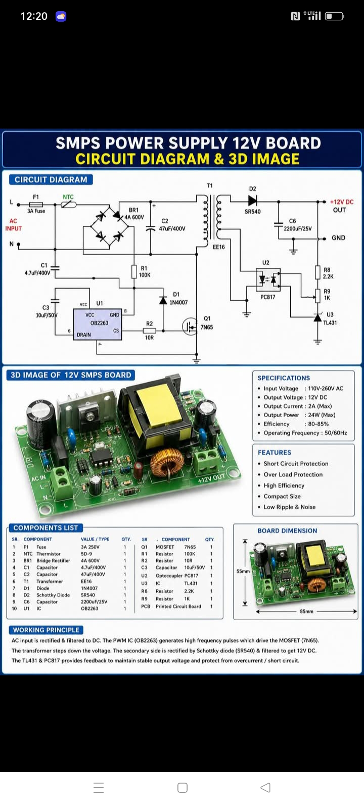
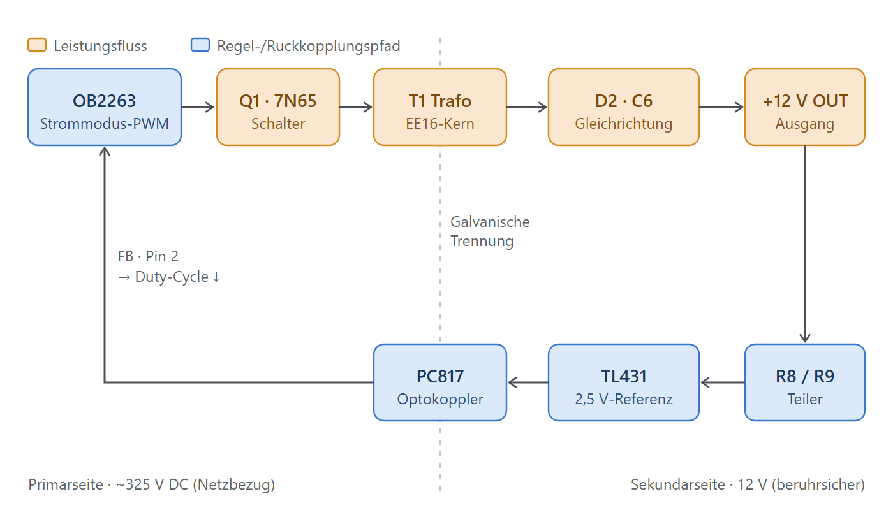
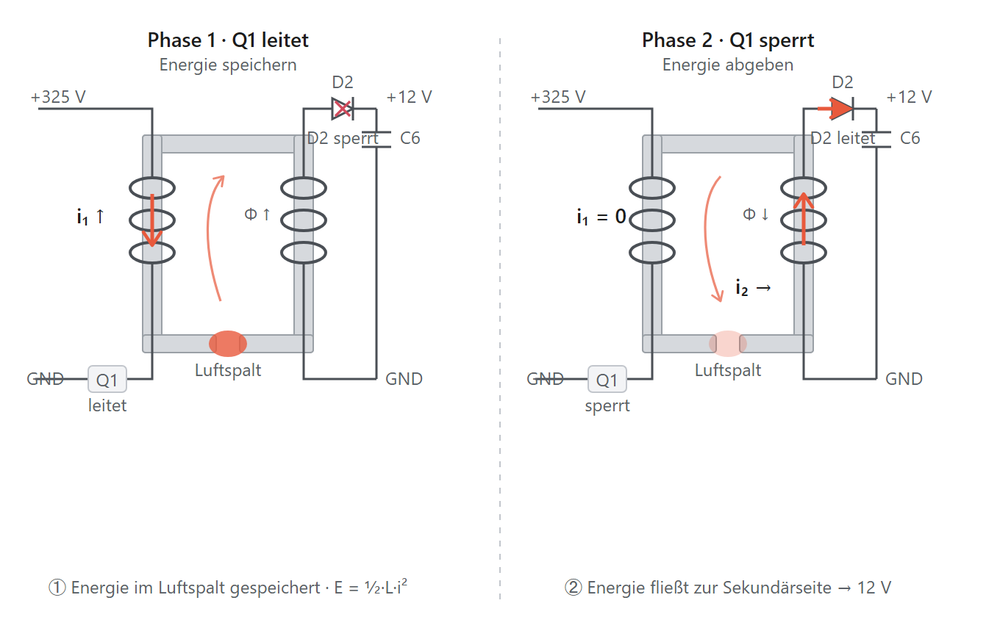
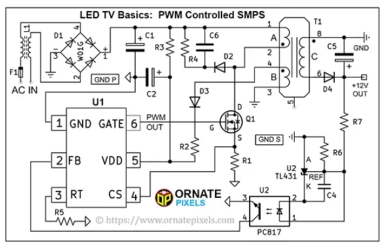
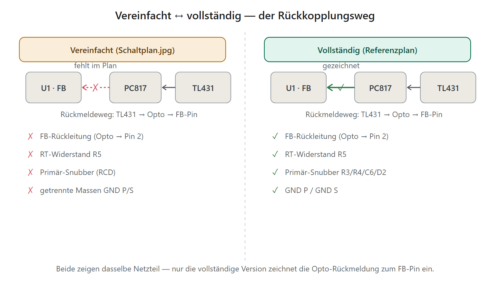

# Ein 12‑V‑Schaltnetzteil verstehen — OB2263, Optokoppler & TL431

*Wie aus 230 V Netzspannung geregelte, berührsichere 12 V werden — ein Werkstattbericht*

> **Kurzfassung:** Die Schaltung ist ein ==isolierter Sperrwandler== (Flyback‑Schaltnetzteil) mit rund 12 V Ausgang und etwa 10–15 W. Ein PWM‑Controller **OB2263** taktet einen MOSFET, ein kleiner Trafo speichert die Energie häppchenweise und trennt gleichzeitig die gefährliche Netzseite von der sicheren 12‑V‑Seite. Geregelt wird die Ausgangsspannung sekundärseitig mit einem **TL431** und isoliert über einen **Optokoppler PC817** an den Controller zurückgemeldet. Dieses Prinzip steckt in fast jedem Steckernetzteil und Ladegerät.

---

## 🧭 Ausgangslage — was liegt auf dem Tisch?

Vor uns liegt der Schaltplan eines kompakten Netzteils, das aus dem 230‑V‑Wechselstromnetz stabile **12 V Gleichspannung** macht. Es ist ein **primärgetaktetes Schaltnetzteil** — kein schwerer 50‑Hz‑Trafo, sondern ein winziger Hochfrequenz‑Trafo (Kerngröße EE16), der mit rund 65 kHz betrieben wird. Das macht das Ganze klein, leicht und effizient.

Die Schaltung zerfällt in ==zwei galvanisch getrennte Welten==:

- **Primärseite** — direkt am Netz, führt lebensgefährliche ~325 V Gleichspannung
- **Sekundärseite** — berührsichere 12 V für den Verbraucher

Verbunden sind beide **nur** über zwei Bauteile: den **Trafo** (überträgt Energie) und den **Optokoppler** (überträgt Information). Genau diese Trennung ist das Sicherheitsherz der Schaltung.

---

## 📐 Der große Überblick — die Topologie

Das Funktionsprinzip heißt **Sperrwandler** (englisch *flyback*):

> Der MOSFET zerhackt die Gleichspannung in schnelle Impulse. In der Einschaltphase wird Energie im Trafo gespeichert, in der Ausschaltphase an den Ausgang „ausgeworfen". Primär- und Sekundärseite leiten dabei **nie gleichzeitig**.

Der Regelkreis schließt sich einmal im Uhrzeigersinn: Der Controller steuert den Schalter (Leistung), die 12 V werden gemessen und über den Optokoppler zurückgemeldet (Information) — und der Controller korrigiert nach.

🟠 = Leistungsfluss · 🔵 = Regel-/Rückkopplungspfad. Der Trafo (oben) und der Optokoppler (unten) sind die einzigen Brücken über die galvanische Trennung.

---

## 🔩 Signalfluss — Block für Block

**1. Netzeingang & Schutz**
- 🛡️ **F1 (3 A)** — Sicherung gegen Überstrom und Brandfall
- 🛡️ **NTC** — Einschaltstrombegrenzer: kalt hochohmig, dämpft den Ladestromstoß beim Einschalten; erwärmt sich dann und wird niederohmig
- **C1 (4,7 µF / 400 V)** — Eingangs‑/Entstörkondensator

**2. Gleichrichtung & Sieben**
- **BR1 (4 A / 600 V)** — Brückengleichrichter: macht aus 230 V~ pulsierenden Gleichstrom
- **C2 (47 µF / 400 V)** — Lade‑Elko: glättet auf die ==~325 V Zwischenkreisspannung==. Das ist die „Batterie", aus der der Wandler schöpft.

**3. Anlauf & Controller‑Versorgung**
- **R1 (100 k)** — Anlaufwiderstand: lädt beim Einschalten langsam den VCC‑Kondensator, bis der OB2263 seine Einschaltschwelle (UVLO) erreicht
- **C3 (10 µF / 50 V)** — VCC‑Stützkondensator
- **D1 (1N4007) + Hilfswicklung** — nach dem Anlauf versorgt eine Hilfswicklung am Trafo den Controller dauerhaft

**4. Schaltstufe**
- **Q1 (7N65)** — der Leistungs‑MOSFET, das eigentliche Schaltventil (Details unten)
- **T1 (EE16)** — der Sperrwandler‑Trafo, Energiespeicher und Trennstelle (Details unten)
- **R2 (10 Ω)** — Strom‑Messwiderstand für die Stromregelung

**5. Sekundär‑Gleichrichtung**
- **D2 (SR540)** — Schottky‑Diode (5 A / 40 V): leitet in der Ausschaltphase, geringe Verluste
- **C6 (2200 µF / 25 V)** — Ausgangs‑Elko: glättet auf saubere 12 V

---

## 🎯 Herzstück: Die Regelung (OB2263 + Optokoppler + TL431)

Der OB2263 ist ein ==Strommodus‑PWM‑Controller==. Das Besondere: Er regelt nicht direkt die Spannung, sondern in **jedem einzelnen Takt den Spitzenstrom** durch den MOSFET. Daraus ergeben sich zwei ineinander verschachtelte Regelschleifen.

### 🔬 Innere, schnelle Schleife — Stromregelung (CS / R2)

Sobald Q1 einschaltet, steigt der Strom rampenförmig an. R2 (10 Ω) bildet ihn als Spannung am **CS‑Pin** ab. Erreicht diese die vom FB‑Pin vorgegebene Schwelle, schaltet der OB2263 den MOSFET ==Takt für Takt sofort ab==. Vorteile: sehr gute Netzausregelung — und der **Überstromschutz ist praktisch geschenkt**. Interne Extras: *Leading‑Edge‑Blanking* (blendet den Einschalt‑Stromspike aus) und *Slope‑Kompensation* (verhindert Schwingen bei >50 % Tastverhältnis).

### 🔑 Äußere, langsame Schleife — Spannungsregelung (der Optokoppler‑Pfad)

Hier läuft die eigentliche „12 V"-Regelung, komplett **sekundärseitig gemessen** und isoliert zurückgemeldet:

1. **U3 (TL431)** — eine programmierbare Präzisionsreferenz mit interner **2,5‑V‑Referenz**. Sie ist Referenz **und** Fehlerverstärker in einem Bauteil und vergleicht über den Teiler **R8/R9** die Ausgangsspannung mit ihrem Sollwert.
2. **U2 (PC817)** — der Optokoppler. Seine LED steuert der TL431 an; der Fototransistor sitzt primärseitig am **FB‑Pin (Pin 2)** des OB2263 und ist die einzige Signalbrücke über die Trennstelle.

Die Wirkungskette bei **steigender** Ausgangsspannung (das Vorzeichen der Regelung):

> U_out ↑ → Teiler hebt REF über 2,5 V → TL431 zieht mehr Strom → PC817‑LED heller → Fototransistor leitet stärker → **FB‑Pin wird heruntergezogen** → OB2263 senkt die Stromschwelle → Q1 schaltet früher ab → weniger Energie pro Takt → **U_out sinkt wieder.**

Und exakt umgekehrt, wenn die Spannung einbricht. Das ist eine saubere ==Gegenkopplung==. Laut Datenblatt liegt die *Zero‑Duty‑Schwelle* bei FB ≈ 0,75 V: Zieht der Optokoppler FB so weit herunter, geht das Tastverhältnis gegen null.

### 🧮 Der Sollwert (TL431‑Formel)

Der TL431 regelt so, dass an seinem REF‑Pin genau 2,5 V anliegen:

$$U_{out} = 2{,}5\,\text{V} \times \left(1 + \frac{R_{oben}}{R_{unten}}\right)$$

> ⚠️ **Zum Mitrechnen:** Mit den *im Schaltbild angeschriebenen* Werten R8 = 2,2 k / R9 = 1 k käme rechnerisch 2,5 × (1 + 2,2) = **≈ 8 V** heraus, nicht 12 V. Für echte 12 V braucht man R_oben/R_unten ≈ 3,8 (z. B. ~3,8 k / 1 k). Solche „Circuit‑Diagram"-Grafiken sind **prinzipiell** korrekt — die konkreten Bauteilwerte sollte man aber nicht als exakt nehmen.

---

## 🧲 Der Sperrwandler‑Trafo als Energiespeicher

Das Wichtigste vorweg: **T1 ist gar kein „Trafo" im klassischen Sinn**, sondern eine ==gekoppelte Speicherdrossel==. Er arbeitet im Zweitakt.

| Klassischer Trafo | Sperrwandler‑Trafo (Flyback) |
|---|---|
| Energie fließt gleichzeitig rein und raus | erst speichern, dann abgeben |
| Primär & Sekundär leiten zusammen | leiten **nie** gleichzeitig |
| speichert (idealerweise) keine Energie | **muss** Energie zwischenspeichern |

**① Speichern (Q1 leitet):** Der Primärstrom steigt rampenförmig, der magnetische Fluss wächst, Feldenergie lädt sich auf: $E = \tfrac{1}{2}\,L\,i^2$. Die Diode D2 sperrt — noch fließt nichts zum Ausgang.

**② Abgeben (Q1 sperrt):** Der Strom wird schlagartig unterbrochen. Der Fluss kann nicht springen, also kehrt sich die Spannung um, D2 wird leitend, und die gespeicherte Energie wird an C6/den Ausgang „ausgeworfen" (daher *Fly‑back*).

> 🔑 **Warum der Luftspalt entscheidend ist:** Im kleinen Luftspalt des EE16‑Kerns steckt der Löwenanteil der Energie. Ohne Spalt würde das Ferrit schon bei kleinem Strom in die **Sättigung** gehen und der MOSFET durchbrennen. Ein reiner Trafo *will* keinen Spalt — ein Flyback‑Trafo *braucht* ihn.

Nebenbei leistet T1 noch zweierlei: die **Spannungsübersetzung** über das Windungsverhältnis $n = N_p/N_s$ (aus 325 V werden 12 V) und die **galvanische Trennung** der beiden Wicklungen.

**Die Brücke zur Regelung:** Die pro Takt übertragene Leistung ist im lückenden Betrieb (DCM) grob $P \approx \tfrac{1}{2}\,L\,i_{pk}^2 \cdot f$. Genau an dieser Schraube — *wie hoch der Primärstrom pro Takt laufen darf* — dreht der Regelkreis.

---

## 🔦 Der Optokoppler PC817 — Information über die Grenze

Der PC817 vereint **LED und Fototransistor** in einem Gehäuse, die sich nur mit Licht verständigen. Es gibt ==keine elektrische Verbindung== — es wandern nur Photonen über einen Isolierspalt (typ. bis ~5000 V spannungsfest). Das übertragene Signal ist ein **Strom bzw. eine Lichtstärke**, keine Spannung.

Der Kennwert ist das **CTR** (Current Transfer Ratio), das Verhältnis von Kollektor‑ zu LED‑Strom:

$$I_C = \text{CTR} \times I_{LED}$$

Beim PC817 liegt CTR grob bei 50–600 % (die Bauteile sind in Klassen sortiert). Wichtig: Er arbeitet hier **analog im linearen Bereich** — er überträgt einen stufenlosen Fehlerpegel, nicht nur „ein/aus". Weil der Fototransistor relativ langsam ist, begrenzt er die Regelbandbreite; deshalb braucht der TL431 in der Praxis noch ein RC‑Kompensationsglied.

> 💡 **Merksatz:** Der Trafo überträgt die **Energie** isoliert, der Optokoppler überträgt die **Information** isoliert. Zusammen schließen sie den Regelkreis über die Sicherheitsgrenze hinweg.

---

## 🔀 Der MOSFET 7N65 — der Zerhacker

Q1 (**650 V / ~7 A N‑Kanal‑Leistungs‑MOSFET**) ist das schnell schaltende Ventil, das aus der ruhenden Gleichspannung erst die hochfrequenten Impulse macht — ein Trafo koppelt nur *Wechsel*-/Impulsgrößen, reinen Gleichstrom nicht.

**Warum ausgerechnet 650 V?** In der Ausschaltphase liegt am Drain die Summe aus:

$$U_{Drain} \approx \underbrace{U_{Bus}}_{\sim325\,V} + \underbrace{n\cdot(U_{out}+U_{D2})}_{\text{reflektiert}} + \underbrace{\text{Leck-Spitze}}_{\text{Streuinduktivität}}$$

Das kann leicht 450–550 V erreichen — der 650‑V‑Typ liefert die nötige Sicherheitsreserve.

Q1 spielt drei Rollen zugleich:

| Rolle | Wie |
|---|---|
| **Leistungsschalter** | zerhackt den HV‑Bus mit ~65 kHz → Energie in den Trafo |
| **Stellglied der Regelung** | seine Einschaltdauer bestimmt die übertragene Energie |
| **Strom‑Messpunkt** | sein Source‑Strom über R2 liefert die Strommodus‑Info + Überstromschutz |

Q1 ist damit der Punkt, an dem **Steuerung (Gate), Leistung (Drain/Trafo) und Rückmeldung (Source/CS)** zusammenlaufen.

---

## 🛡️ Schutzfunktionen (im OB2263 integriert)

- ✅ **UVLO** — Unterspannungssperre für sicheren An-/Auslauf
- ✅ **Zyklischer Überstromschutz** — über CS/R2, Takt für Takt
- ✅ **Überlast / Kurzschluss** — Umschalten in *Hiccup*/Auto‑Restart (periodisches Wiederanlaufen statt Durchbrennen)
- ✅ **Übertemperatur** und teils **Ausgangs‑Überspannungsschutz**

---

## ⚠️ Stolpersteine & Hinweise zum Schaltbild

Das vorliegende „Circuit‑Diagram" ist vereinfacht und an einigen Stellen ungenau — gut zu wissen beim Nachvollziehen:

- **Pin‑Beschriftung „DRAIN / 6" am U1** passt nicht zum realen OB2263‑Pinout. Funktional relevant: **FB (Pin 2)** ← Optokoppler, **CS (Pin 4)** ← R2, dazu **GATE** (treibt Q1), **VDD**, **GND**, **RT** (Frequenz). Der Pin zum MOSFET ist der Gate‑Treiber.
- Die **Hilfswicklung** für die VCC‑Versorgung ist nicht eingezeichnet (D1 gehört dazu).
- Ein **Primär‑Snubber (RCD‑Klemme)** über der Primärwicklung, der die Leck‑Spitze am Drain begrenzt, fehlt — auf einer echten Platine ist er praktisch immer vorhanden.
- Der **Spannungsteiler R8/R9** ergibt rechnerisch ~8 V (siehe Formel‑Kasten oben).

---

## 🔁 Vollständiger vs. vereinfachter Schaltplan

Das obige „Circuit‑Diagram" (`Schaltplan.jpg`) lässt einige Verbindungen weg — vor allem die **Rückmeldeleitung vom Optokoppler zum FB‑Pin**. Deshalb wirkt der Optokoppler dort scheinbar „unverbunden". Ein vollständigerer Referenzplan desselben Prinzips (generischer Controller **U1**, aus dem Kontext „LED‑TV — PWM Controlled SMPS") zeichnet sie ausdrücklich ein:

Dort trägt der Controller genau das Pin‑Schema, das wir für den OB2263 beschrieben haben: **1 GND · 2 FB · 3 RT · 4 CS · 5 VDD · 6 GATE**. Und der Regelweg ist lückenlos gezeichnet:

> **+12 V OUT** → Teiler **R7 / R6** → **REF** des **TL431** → TL431 steuert den **PC817**‑LED‑Strom → Licht → Fototransistor → **FB (Pin 2)** von U1 → Emitter auf **GND P**.

Damit wird sichtbar, was im ersten Bild fehlte:

| Detail | Vereinfacht (`Schaltplan.jpg`) | Vollständig (Referenzplan) |
|---|---|---|
| FB‑Pin + Opto‑Rückleitung | fehlt | ✅ gezeichnet |
| RT‑Widerstand (Frequenz) | fehlt | ✅ R5 an Pin 3 |
| Primär‑Snubber (RCD‑Klemme) | fehlt | ✅ R3 / R4 / C6 / D2 |
| Getrennte Massen | nicht markiert | ✅ GND P / GND S |

> 🔑 **Merke:** Über die galvanische Trennung führt **nie ein Draht** — die „Verbindung" ist das Licht im Optokoppler. Die einzige elektrische Rückleitung liegt auf der Primärseite: ==Fototransistor‑Kollektor → FB (Pin 2)==.

Zwei Beschriftungs‑Stolpersteine in diesem Referenzplan: **TL431 und PC817 sind beide mit „U2" beschriftet** (richtig wäre U2 / U3), und **D2** ist dort die **Klemmdiode des Snubbers** — der Ausgangsgleichrichter heißt hier **D4**.

---

## 📚 Bauteilliste

| Bauteil | Wert / Typ | Funktion |
|---|---|---|
| F1 | 3 A | Netzsicherung |
| NTC | Thermistor | Einschaltstrombegrenzung |
| C1 | 4,7 µF / 400 V | Eingangs‑/Entstörkondensator |
| BR1 | 4 A / 600 V | Brückengleichrichter |
| C2 | 47 µF / 400 V | Zwischenkreis‑Elko (~325 V) |
| R1 | 100 k | Anlaufwiderstand |
| D1 | 1N4007 | Gleichrichter Hilfswicklung (VCC) |
| C3 | 10 µF / 50 V | VCC‑Stützkondensator |
| U1 | OB2263 | Strommodus‑PWM‑Controller |
| Q1 | 7N65 | Leistungs‑MOSFET (650 V / ~7 A) |
| R2 | 10 Ω | Strom‑Messwiderstand (CS) |
| T1 | EE16 | Sperrwandler‑Trafo (Speicher + Trennung) |
| D2 | SR540 | Schottky‑Sekundärgleichrichter (5 A / 40 V) |
| C6 | 2200 µF / 25 V | Ausgangs‑Elko |
| U3 | TL431 | Präzisionsreferenz / Fehlerverstärker |
| U2 | PC817 | Optokoppler (isolierte Rückmeldung) |
| R8 / R9 | 2,2 k / 1 k | Spannungsteiler (Sollwert) |

---

## 💡 Verständnisfragen (für den Unterricht)

1. Warum leiten Primär- und Sekundärseite eines Sperrwandlers nie gleichzeitig?
2. Wozu dient der Luftspalt im Trafokern — und was passiert ohne ihn?
3. Welchen Weg nimmt die Regelinformation vom 12‑V‑Ausgang zurück zum Controller?
4. Warum muss der MOSFET 650 V aushalten, obwohl der Bus nur ~325 V führt?
5. Was übernimmt der Optokoppler, was der Trafo — und warum braucht es beide?

---

## 🎯 Fazit

Dieses kleine Netzteil zeigt ein komplettes Regelungskonzept auf engstem Raum: Ein **Strommodus‑Controller** taktet einen MOSFET, ein **Speichertrafo** portioniert die Energie und trennt sicher, und eine **sekundärseitige Regelung aus TL431 + Optokoppler** hält die 12 V stabil — isoliert und präzise. Wer dieses Zusammenspiel aus **Leistungspfad** und **Regelpfad** einmal verstanden hat, erkennt es in fast jedem modernen Steckernetzteil wieder.

---

*Erstellt: 2026‑07‑11 · OB2263‑Sperrwandler‑Analyse · erarbeitet mit Claude Code (Opus 4.8) + Rw*
