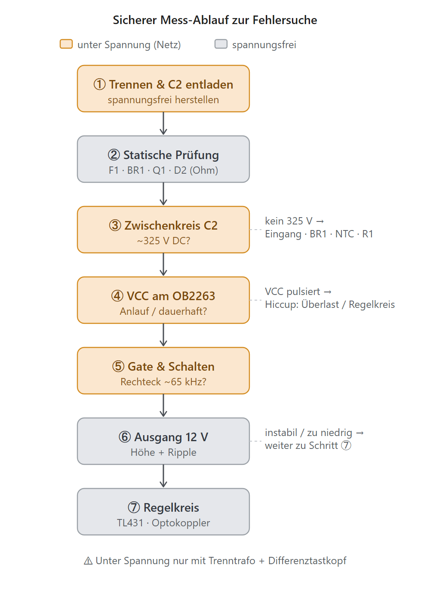

# Störungs- und Fehleranalyse am 12‑V‑Sperrwandler

*Durchführbare Messungen an der OB2263‑Schaltung — ein Werkstattbericht (Service‑Teil)*

> **Kurzfassung:** Dieser Zusatz zeigt, **wie** man das Netzteil systematisch durchmisst — vom spannungsfreien Bauteiltest bis zur Oszilloskop‑Messung unter Spannung. ==Achtung: Die Primärseite führt Netzpotential (~325 V).== Die primäre „Masse" ist **nicht** Schutzerde. Ohne Trenntransformator und Differenztastkopf ist Messen an der Primärseite lebensgefährlich. Zu jedem Messpunkt steht der Sollwert und was eine Abweichung bedeutet.

---

## ⚡ Sicherheit zuerst — bitte vollständig lesen

> 🛑 **Lebensgefahr.** Ein Fehler an der Primärseite kann tödlich sein. Wer sich unsicher ist, misst **nicht** unter Spannung.

- **Primäre „Masse" ≠ Schutzerde.** Der Minuspol von C2 liegt am gleichgerichteten Netz (~325 V gegen Erde). ==Niemals die Masseklemme eines geerdeten Oszilloskops an die Primärseite klemmen== → Kurzschluss über den Schutzleiter, Lichtbogen, Lebensgefahr.
- **Trenntransformator ist Pflicht** für alle Arbeiten unter Spannung. Er hebt den Erdbezug auf, sodass eine einzelne versehentliche Erdberührung nicht sofort einen Stromschlag auslöst. ⚠️ Er macht die Schaltung **nicht** berührsicher — zwischen den Primärpunkten liegen weiterhin ~325 V.
- **Differenztastkopf** (oder galvanisch getrenntes Oszilloskop) für jede primärseitige Scope‑Messung. Sonst gilt die Masse‑Regel oben.
- **C2 entladen vor jeder Arbeit.** Der 47‑µF‑Elko hält nach dem Abschalten gefährliche Ladung. Über einen Widerstand (~10 kΩ / 5 W) entladen, dann mit dem Multimeter auf **< 30 V** prüfen — erst dann anfassen.
- **Erst‑Einschalten über Reihen‑Glühlampe** („Dim‑Bulb‑Tester", 40–100 W in Reihe zum Netz): begrenzt den Strom bei einem Kurzschluss. Lampe leuchtet dauerhaft hell = Kurzschluss; kurz hell, dann dunkel = normal.
- **Einhand‑Regel**, isoliertes Werkzeug, trockener Standplatz, **nie allein** arbeiten.
- Bauteile können **heiß** sein (Q1, Trafo, D2, R1).

---

## 🧰 Ausrüstung

| Gerät | Wofür |
|---|---|
| Trenntransformator (ideal: regelbar / Stelltrafo) | netzbezugsfreies Arbeiten unter Spannung |
| Differenztastkopf + Oszilloskop | Gate‑, Drain‑, CS‑, FB‑Signale primärseitig |
| Digital‑Multimeter (True‑RMS, Dioden-/Ω‑Bereich) | statische Bauteiltests, DC‑Pegel |
| Reihen‑Glühlampe (Dim‑Bulb‑Tester) | Strombegrenzung beim ersten Einschalten |
| Entladewiderstand ~10 kΩ / 5 W | C2 sicher entladen |
| ESR‑Messgerät | Elkos C2 / C6 / C3 bewerten (im ausgebauten/entladenen Zustand) |
| Elektronische Last oder Lastwiderstände | Verhalten unter Last, Regelung prüfen |

---

## 🟢 Teil A — Statische Prüfung (spannungsfrei, C2 entladen)

Multimeter im **Dioden-/Ω‑Bereich**. Deckt die häufigsten Totalausfälle ab, bevor überhaupt Netz angelegt wird.

| Prüfling | Messung | Sollwert / Befund | Deutung bei Abweichung |
|---|---|---|---|
| **F1** | Durchgang | ~0 Ω | unterbrochen → Folgefehler (oft Q1/BR1‑Kurzschluss) suchen |
| **BR1** | 4 Dioden vorwärts/rückwärts | je ~0,4–0,6 V vorwärts, sperrt rückwärts | Kurzschluss → Ursache für durchgebrannte F1 |
| **Q1 (7N65)** | D–S, G–S, G–D | D–S sperrt beidseitig (mit Bodydiode 1 Richtung); G isoliert | ==D–S niederohmig = MOSFET durchlegiert== (klassischer Defekt) |
| **R2** | Widerstand | 10 Ω | hochohmig/offen → kein CS‑Signal, Q1 ungeschützt |
| **R1** | Widerstand | 100 kΩ | offen → kein Anlauf (keine VCC) |
| **D1 / D2** | Diodentest | Durchlass ~0,3 V (D2 Schottky) / ~0,6 V (D1) | Kurzschluss D2 → Ausgang tot / Hiccup |
| **C2 / C6 / C3** | Sichtprüfung + ESR | keine Wölbung, niedriger ESR | aufgebläht/hoher ESR → Ripple, Anlaufprobleme |
| **PC817‑LED** | Diodentest (Pins 1–2) | Durchlass ~1,0–1,2 V | offen → Regelkreis unterbrochen → Überspannung |
| **R8 / R9** | Widerstand | 2,2 kΩ / 1 kΩ | Drift → falsche Ausgangsspannung |

---

## 🟠 Teil B — Messungen unter Spannung (Trenntrafo + Differenztastkopf!)

Reihenfolge nach dem Ablauf‑Diagramm unten. Netz **über den Dim‑Bulb‑Tester** zuschalten.

| Messpunkt | Gerät | Sollwert | Deutung bei Abweichung |
|---|---|---|---|
| **C2 (Zwischenkreis)** | DMM DC, Ref. Primärmasse | ~300–325 V DC | kein/zu niedrig → Eingang, BR1, NTC, C2, Last/Kurzschluss |
| **VCC / VDD am OB2263** | Scope, Ref. Primärmasse | steigt auf Einschaltschwelle (~16 V), dann stabil aus Hilfswicklung | ==sägezahnartig pulsierend (2–16 V) = Hiccup== → Überlast, Kurzschluss sekundär, offener Regelkreis oder fehlende Hilfsversorgung |
| **Gate von Q1** | Differenztastkopf | Rechteck, ~65 kHz, ~10–18 V | kein Signal → Controller startet nicht (VCC/UVLO); Dauer‑High/Low → Defekt |
| **Drain von Q1** | Differenztastkopf | Schaltflanken; Spitze = Bus + reflektiert + Leck‑Spike | ==Spitze nahe/über 650 V== → Snubber fehlt/defekt, Q1 gefährdet |
| **CS‑Pin (an R2)** | Differenztastkopf | Sägezahn je Takt, Spitze an der Strombegrenzung (~0,5–1 V) | flach/0 → R2 offen; ständig am Limit → Überlast/Trafo/Kurzschluss |
| **FB‑Pin** | Differenztastkopf | DC ~1–3 V im Regelbetrieb | ~0,75 V = Duty→0 (Überspannung sekundär?); dauerhaft hoch = offener Regelkreis → volle Leistung |
| **+12 V Ausgang** | DMM DC + Scope AC, Ref. Sekundärmasse | 12 V ±5 %, Ripple < ~100 mVpp | zu niedrig/instabil → Regelkreis/Last/C6; zu hoch → Regelkreis offen |
| **C6 Ripple** | Scope AC‑Kopplung | einige 10 mVpp | großer Ripple/Brumm → C6 Kapazität/ESR, D2 |
| **TL431 REF** | DMM, Ref. Sekundärmasse | ~2,5 V bei Regelung | ≠ 2,5 V → TL431 oder Teiler R8/R9 defekt |

> 💡 **Massebezug beachten:** Sekundärmessungen (Ausgang, TL431) referenzieren die **Sekundärmasse** (sicher, isoliert) — hier genügt ein normaler Tastkopf. Primärmessungen (C2, VCC, Gate, Drain, CS, FB) referenzieren die **Primärmasse** (netzbezogen) — nur mit Differenztastkopf.

---

## 🔎 Symptom → Ursache (Schnelldiagnose)

| Symptom | Wahrscheinliche Ursachen | Zuerst prüfen |
|---|---|---|
| **Völlig tot, keine VCC** | F1 offen, BR1/Q1 kurz, C2 defekt, R1 offen, OB2263 defekt | Teil A + C2 |
| **Tickt/pfeift, Ausgang bricht ein (Hiccup)** | Überlast/Kurzschluss sekundär, D2 kurz, C6 kurz, offener Regelkreis (Opto/TL431) | VCC‑Verlauf, D2, Opto |
| **Ausgang zu hoch** | Regelkreis offen: PC817‑LED, TL431, R8/R9 | FB‑Pin, Opto, TL431 |
| **Ausgang zu niedrig / bricht unter Last ein** | C2‑ESR, C6‑ESR, D2, schwache Regelung | ESR C2/C6, D2 |
| **Hoher Ripple / Brummen** | C6 (Kapazität/ESR), D2 | Ripple am Ausgang |
| **F1 schwarz durchgebrannt** | primärer Kurzschluss: Q1, BR1, C2 | Teil A statisch |
| **Q1 wird sehr heiß** | Snubber fehlt/defekt, Überlast, hoher Schaltverlust | Drain‑Spitze, Last |

---

## 🧪 Praxistipps

- **Hiccup verstehen:** Ein periodisches „Ticken" mit auf‑ und abschwellender VCC ist der Auto‑Restart‑Schutz des OB2263. Er zeigt: Der IC *will*, aber etwas belastet den Ausgang oder die Rückkopplung fehlt. Das ist ein **Symptom**, keine Ursache.
- **Regelkreis gezielt testen:** Ausgang leicht belasten und beobachten, ob FB reagiert. Reagiert FB nicht auf Laständerung → Opto/TL431‑Pfad unterbrochen.
- **Leerlauf‑Pfeifen** bei sehr kleiner Last ist oft der Burst-/Sparbetrieb — meist normal, kein Defekt.
- **Erst hochfahren, dann belasten:** Mit Stelltrafo langsam hochregeln, dabei C2 und den Dim‑Bulb beobachten — so erkennt man Kurzschlüsse, bevor etwas abraucht.
- **Immer wieder entladen:** Nach jedem Abschalten C2 erneut entladen und nachmessen, bevor du greifst.

---

## 🎯 Fazit

Die Fehlersuche folgt einem klaren Pfad: **erst spannungsfrei** die üblichen Verdächtigen (F1, BR1, Q1, D2) ausschließen, dann **unter Spannung** entlang der Signalkette C2 → VCC → Gate → Ausgang messen — und Auffälligkeiten mit der Symptomtabelle verknüpfen. Der wichtigste Satz bleibt: ==Primärseite = Netzpotential; unter Spannung nur mit Trenntrafo und Differenztastkopf.==

---

*Erstellt: 2026‑07‑11 · OB2263‑Sperrwandler · Mess- & Fehleranalyse · erarbeitet mit Claude Code (Opus 4.8) + Rw*
