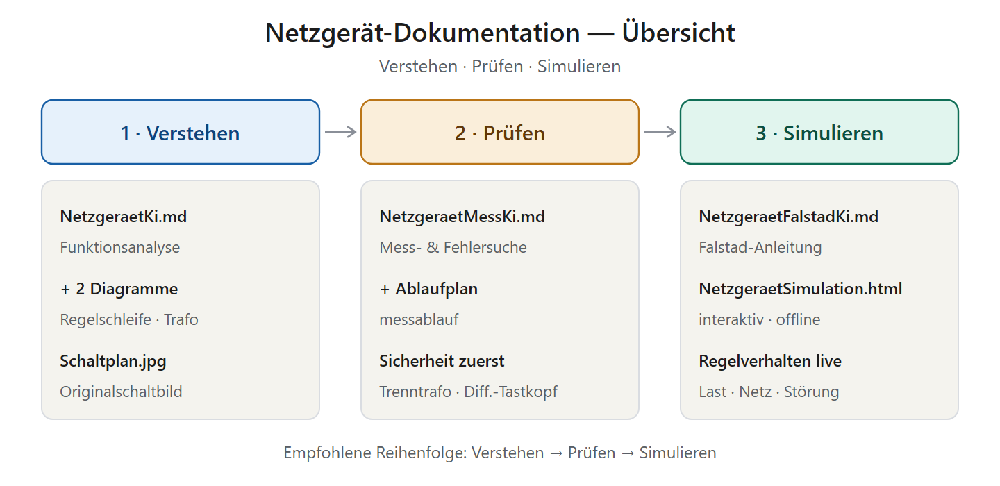

# Netzgerät (OB2263‑Sperrwandler) — Gesamtübersicht

*Startseite und Wegweiser durch die komplette Dokumentation — ein Werkstattbericht*

> **Kurzfassung:** Diese Seite bündelt alles, was wir zum 12‑V‑Schaltnetzteil erarbeitet haben, in drei Schritten: ==Verstehen → Prüfen → Simulieren==. Unten findest du ein Inhaltsverzeichnis, zu jeder Datei eine Notiz mit ihrem Inhalt und einen empfohlenen Lernpfad. Die Startdatei zum Reinlesen ist immer `NetzgeraetKi.md`.

---

## 📑 Inhaltsverzeichnis

| # | Datei | Inhalt (kurz) | Für wen |
|---|---|---|---|
| 1 | [NetzgeraetKi.md](NetzgeraetKi.md) | **Funktionsanalyse** der ganzen Schaltung inkl. Regelung, Trafo, Bauteile | Einstieg, Verständnis |
| 2 | [NetzgeraetMessKi.md](NetzgeraetMessKi.md) | **Störungs‑ & Fehleranalyse** — sichere Messungen mit Sollwerten | Reparatur, Service |
| 3 | [NetzgeraetFalstadKi.md](NetzgeraetFalstadKi.md) | **Falstad‑Anleitung** — Schaltung im Browser nachbauen | Selbermachen, Nachbau |
| 4 | [NetzgeraetSimulation.html](NetzgeraetSimulation.html) | **Interaktive Simulation** des Regelverhaltens (offline) | Ausprobieren, Unterricht |

*(Jede `.md`‑Datei liegt zusätzlich als fertige `.pdf` vor.)*

---

## 📘 1 · Verstehen — `NetzgeraetKi.md`

Die Grundlagen‑Analyse: Was ist das für ein Netzteil und wie arbeitet es?

- 🧭 **Ausgangslage & Topologie** — isolierter Sperrwandler (Flyback), Primär‑/Sekundärseite, ~10–15 W
- 🔩 **Signalfluss Block für Block** — Sicherung/NTC → Gleichrichter → Zwischenkreis → Schaltstufe → Sekundärgleichrichtung
- 🎯 **Die Regelung im Detail** — OB2263 im Strommodus, innere Stromschleife (CS/R2) + äußere Spannungsschleife (Optokoppler/TL431), inkl. TL431‑Formel
- 🧲 **Der Sperrwandler‑Trafo** — Speichern/Abgeben, Bedeutung des Luftspalts
- 🔦 **Optokoppler PC817** & 🔀 **MOSFET 7N65** — je ein Detailkapitel
- 🛡️ **Schutzfunktionen**, ⚠️ **Hinweise zum Schaltbild**, 📚 **Bauteilliste**, 💡 **Verständnisfragen**
- 🔁 **Vollständiger vs. vereinfachter Schaltplan** — warum die Opto‑Rückmeldung zum FB‑Pin im ersten Bild fehlt (mit Vergleichsgrafik)
- **Diagramme:** `regelschleife.png` (Regelkreis) · `trafo_zwei_phasen.png` (Energie speichern/abgeben) · `vergleich_schaltplaene.png` (Gegenüberstellung)

---

## 🔧 2 · Prüfen — `NetzgeraetMessKi.md`

Der Service‑Teil: Wie findet man einen Fehler — sicher?

- ⚡ **Sicherheit zuerst** — ==Primärseite = Netzpotential==, Trenntrafo + Differenztastkopf zwingend, C2 entladen, Dim‑Bulb‑Tester
- 🧰 **Ausrüstung** — was man wofür braucht
- 🟢 **Teil A · Statische Prüfung** (spannungsfrei) — Bauteil‑Tabelle mit Soll‑Befund
- 🟠 **Teil B · Messungen unter Spannung** — Messpunkte mit **Sollwerten und Fehlerdeutung** (C2, VCC, Gate, Drain, CS, FB, Ausgang, TL431)
- 🔎 **Symptom → Ursache** — Schnelldiagnose‑Tabelle
- **Diagramm:** `messablauf.png` (sicherer Mess‑Ablauf in 7 Schritten)

---

## 🖥️ 3 · Simulieren — `NetzgeraetFalstadKi.md` + `NetzgeraetSimulation.html`

Zwei Wege, das Verhalten selbst zu erleben:

**`NetzgeraetFalstadKi.md`** — Aufbauanleitung für den kostenlosen Browser‑Simulator Falstad:
- Warum Falstad, wichtige Einstellung (==Time step ~1e‑7==)
- 7 Schritte: Zwischenkreis → Trafo → MOSFET → Gleichrichtung → PWM → Rückkopplung → Messen
- Bauteil‑/Wertetabelle, Stolpersteine, Ausbaustufen
- Kern: OB2263 wird durch Sägezahn + Komparator + Op‑Amp ersetzt (gleiche Wirkung)

**`NetzgeraetSimulation.html`** — fertige interaktive Simulation, ==offline in jedem Browser==:
- Schieberegler für **Netzspannung** und **Laststrom**, Knöpfe für **Lastsprung** und **Regelung öffnen**
- Live‑Anzeige von U_out, Tastverhältnis, Spitzenstrom + zwei Oszilloskop‑Ansichten
- Zeigt Regelung, Netz‑/Lastausregelung und (bei offenem Kreis) die **Überspannung**

---

## 🧭 Empfohlener Lernpfad

1. **Zuerst `NetzgeraetKi.md`** lesen — das Prinzip verstehen (mit den beiden Diagrammen).
2. **Dann `NetzgeraetSimulation.html`** öffnen — am Modell „spielen", bis das Regelverhalten sitzt.
3. **Optional `NetzgeraetFalstadKi.md`** — die Schaltung selbst im Browser nachbauen.
4. **Bei Reparatur/Defekt `NetzgeraetMessKi.md`** — nach dem Sicherheits‑Ablauf messen.

---

## 🗂️ Alle Dateien im Ordner

| Datei | Typ | Beschreibung |
|---|---|---|
| `NetzgeraetUebersichtKi.md` | Doku | **Diese Übersicht** (Startseite) |
| `NetzgeraetKi.md` / `.pdf` | Doku | Funktionsanalyse |
| `NetzgeraetMessKi.md` / `.pdf` | Doku | Mess- & Fehleranalyse |
| `NetzgeraetFalstadKi.md` / `.pdf` | Doku | Falstad‑Simulationsanleitung |
| `NetzgeraetSimulation.html` | Interaktiv | Offline‑Simulation des Regelverhaltens |
| `regelschleife.svg` / `.png` | Diagramm | Regelkreis OB2263 ↔ Opto ↔ TL431 |
| `trafo_zwei_phasen.svg` / `.png` | Diagramm | Trafo: Energie speichern/abgeben |
| `messablauf.svg` / `.png` | Diagramm | Sicherer Mess‑Ablauf (7 Schritte) |
| `projektkarte.svg` / `.png` | Diagramm | Titelbild dieser Übersicht |
| `vergleich_schaltplaene.svg` / `.png` | Diagramm | Gegenüberstellung: vereinfachter vs. vollständiger Schaltplan (Rückkopplungsweg) |
| `Schaltplan.jpg` / `SchaltplanKl.JPG` | Bild | Vereinfachtes Originalschaltbild (groß / klein) |
| `Schaltplan_vollstaendig.jpg` | Bild | Vollständiger Referenzplan (LED‑TV‑SMPS) — zeigt FB‑Rückleitung, Snubber R3/R4/C6/D2, GND P/S |
| `PlatineKl.JPG` | Bild | Foto der realen 12‑V‑SMPS‑Platine (Bauteil‑Zuordnung) |
| `TL431.png` | Bild | TL431: Symbol, Anschlüsse (C/R/A) und Innenschaltung (2,5‑V‑Referenz + Fehlerverstärker) |
| `logorw96.png` | Bild | Logo (Signatur‑Footer) |

---

## 🔑 Die wichtigsten Kernaussagen (zum Merken)

- **Zwei getrennte Welten:** Der Trafo überträgt die **Energie** isoliert, der Optokoppler die **Information** — zusammen schließen sie den Regelkreis über die Sicherheitsgrenze.
- **Strommodus‑Regelung:** Der OB2263 regelt Takt für Takt den **Spitzenstrom**; die 12 V werden sekundär mit TL431 gemessen und per Opto zurückgemeldet.
- **Der „Trafo" ist ein Speicher:** Energie wird im **Luftspalt** zwischengelagert (Speichern/Abgeben), nicht direkt durchgereicht.
- **Ohne Rückkopplung droht Überspannung** — im Simulator sichtbar zu machen.
- **Sicherheit:** ==Primärseite führt Netzpotential; unter Spannung nur mit Trenntrafo und Differenztastkopf.==

---

*Erstellt: 2026‑07‑11 · OB2263‑Sperrwandler · Gesamtübersicht · erarbeitet mit Claude Code (Opus 4.8) + Rw*
