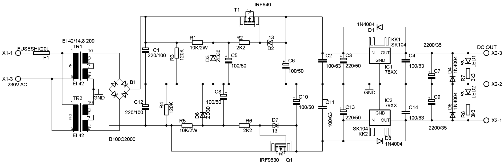
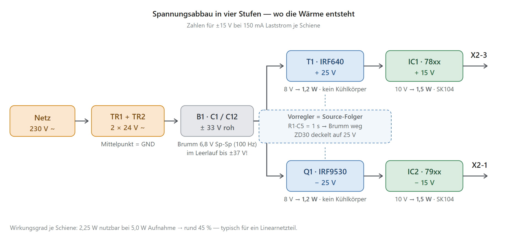

# Ein symmetrisches Trafo-Netzteil verstehen — MOSFET-Vorregler + 78xx/79xx

*Warum zwischen Gleichrichter und Festspannungsregler noch ein Leistungs-MOSFET sitzt — ein Werkstattbericht*

> **Kurzfassung:** Die Schaltung ist ein ==klassisches symmetrisches Linearnetzteil== mit zwei Netztrafos, deren Sekundärwicklungen in Reihe liegen; der Mittelpunkt ist Masse. Eine einzige Brücke erzeugt daraus **±33 V Rohspannung**. Das Besondere ist die Stufe dazwischen: je ein **MOSFET als Source-Folger** (IRF640 / IRF9530) arbeitet als *Kapazitätsvervielfacher* und *Spannungsdeckel*. Er siebt den 100-Hz-Brumm praktisch vollständig weg und begrenzt die Eingangsspannung der nachfolgenden **78xx/79xx**-Regler auf ~25 V — ohne diesen Deckel würden die Regler im Leerlauf mit 37 V über ihrer zulässigen Eingangsspannung betrieben.

---

## 🧭 Ausgangslage — was liegt auf dem Tisch?

Ein Netzteil, das aus 230 V~ eine **symmetrische Gleichspannung** macht: eine positive und eine gleich große negative Schiene gegen eine gemeinsame Masse. So etwas braucht man überall dort, wo Operationsverstärker, Analogschaltungen oder Messverstärker versorgt werden sollen — die brauchen beide Polaritäten.

Im Gegensatz zum [Sperrwandler](../NetzgeraetKi.md) arbeitet hier **nichts getaktet**. Es gibt keinen Controller, keinen Optokoppler, keine Regelschleife im eigentlichen Sinn. Alles ist ==analog, stetig und langsam== — und genau deshalb ist die Schaltung so gutmütig: kein HF-Dreck, kein Layout-Drama, keine Streuinduktivität.

Die Schaltung zerfällt in **vier Stufen**, die die Spannung schrittweise abbauen:

---

## 🔌 Stufe 1 — Zwei Trafos, eine Brücke, ein Mittelpunkt

**TR1 und TR2** (EI 42/14,8, je rund 5–6 VA) hängen mit ihren **Primärwicklungen parallel** am Netz. Bei beiden sind die zwei Sekundärwicklungen über **Pin 7 in Reihe** geschaltet — aus 2 × 12 V werden also je 24 V.

Der Trick steckt in der Verschaltung der beiden Trafos:

| Knoten | Verbindung |
|---|---|
| TR1 Pin 10 | → Brücke B1, Wechselstrom-Eingang 1 |
| TR1 unten **+** TR2 Pin 10 | → **GND** (der Mittelpunkt) |
| TR2 unten | → Brücke B1, Wechselstrom-Eingang 2 |
| B1 `+` → C1 → GND | positive Rohschiene |
| B1 `−` → C12 → GND | negative Rohschiene |

> 🔑 **Warum das elegant ist:** Beide Sekundärwicklungen liegen in Reihe, die Brücke sieht die Summe (48 V~) — aber weil der Mittelpunkt auf Masse liegt, teilt sich das Ergebnis in zwei symmetrische Schienen auf. Der Strompfad geht dabei jeweils nur über **eine** Diode, nicht über zwei. Das spart einen Diodenabfall gegenüber zwei getrennten Brücken.

$$U_{roh} \approx U_{sek} \cdot \sqrt{2} - 0{,}9\,\text{V} \quad \text{je Schiene, Brummfrequenz 100 Hz}$$

Konkret mit 24 V Sekundärspannung:

| Betriebsfall | Ergebnis |
|---|---|
| Nennlast (~150 mA) | **± 33 V** |
| Leerlauf (kleine Trafos haben +10…15 % Überspannung) | **± 37 V** ⚠️ |

Und genau dieser Leerlaufwert ist der Grund für die ganze nächste Stufe: ==ein 7815 verträgt nur 35 V am Eingang==.

**C1 / C12 (220 µF/100 V)** sind die Ladeelkos, **R3 / R4 (120 k)** die Symmetrier- und Entladewiderstände darüber. Letztere ziehen 0,27 mA und entladen die Elkos nach dem Abschalten mit τ = 26 s — nach gut zwei Minuten ist die Schaltung spannungsfrei.

---

## 🎚️ Stufe 2 — Das Herzstück: der MOSFET-Vorregler

Beide Schienen sind spiegelbildlich aufgebaut. Für die positive Seite: **R1, D3, C5, R2, D2 und T1 (IRF640)**; negativ dasselbe mit **R5, D6, C8, R6, D7 und Q1 (IRF9530)**.

**T1 arbeitet als Source-Folger:** Drain an der Rohspannung, Source am Eingang des 78xx. Der Ausgang folgt dem Gate — abzüglich der Gate-Source-Spannung:

$$U_{vor} = U_{Gate} - U_{GS} \approx U_{Gate} - 4\,\text{V}$$

Die ganze Kunst steckt darin, **wie die Gate-Spannung erzeugt wird**.

### 🧊 R1 + C5 — der Kapazitätsvervielfacher

R1 (10 k) und C5 (100 µF) bilden einen Tiefpass mit der Zeitkonstante

$$\tau = R_1 \cdot C_5 = 10\,\text{k}\Omega \cdot 100\,\mu\text{F} = \mathbf{1\ Sekunde}$$

Gegenüber der Brummperiode von 10 ms ist das der **Faktor 100**. Am Gate steht damit praktisch reine Gleichspannung — und weil der Source ihr folgt, ist auch die Ausgangsspannung der Stufe brummfrei. Das Gate zieht dabei keinen Strom, der große Widerstand kostet also nichts.

> 💡 **Der Clou:** C5 mit seinen 100 µF wirkt am Ausgang so, als hinge dort ein Elko von *C5 × Stromverstärkung* — bei einem MOSFET also praktisch unendlich groß. Man bekommt die Siebwirkung eines riesigen Elkos für 10 Cent. Deshalb der Name **Kapazitätsvervielfacher**.

### 🧢 D3 (ZD30) — der Deckel, nicht die Referenz

Hier wird gern falsch gelesen: Die 30-V-Z-Diode ist **keine Referenz, die den Arbeitspunkt bestimmt**, sondern eine **obere Begrenzung**.

- Solange U_roh unter 30 V liegt, sperrt D3 und C5 lädt sich einfach auf den **Mittelwert** der Rohspannung auf.
- Steigt U_roh darüber (Leerlauf, Netzüberspannung), klemmt D3 das Gate bei ~30 V fest.

$$U_{vor} = \min\left(\overline{U_{roh}}\ ;\ U_{Z}\right) - U_{GS} \approx \mathbf{25\ V}$$

Damit ist garantiert, dass der 78xx **nie** mehr als ~25 V am Eingang sieht — auch nicht ohne Last. Das ist die eigentliche Existenzberechtigung der Stufe.

### 🛡️ R2 und D2 — zwei kleine Bauteile, zwei echte Probleme gelöst

**R2 (2k2) ist der Gate-Stopper.** Mit der Eingangskapazität des IRF640 (C_iss ≈ 1,3 nF) ergibt das ein RC-Glied von rund 3 µs. Source-Folger mit steilen Leistungs-MOSFETs neigen an kapazitiver Last zum **HF-Schwingen** — der Gate-Widerstand bedämpft das zuverlässig. Ein Detail, das in vielen Nachbauten fehlt und dann stundenlanges Rätselraten am Oszilloskop verursacht.

**D2 (Z-Diode 13 V) schützt die Gate-Source-Strecke.** Im Normalbetrieb liegt U_GS bei ~4 V, die Diode tut nichts. Bei einem **Ausgangskurzschluss** wird der Source aber auf Masse gezogen — dann läge die volle Gate-Spannung von 30 V über Gate-Source. Der IRF640 verträgt nur ±20 V, das Gate-Oxid würde sofort durchschlagen. D2 klemmt bei 13 V. ==Ohne diese Diode ist die Schaltung nicht kurzschlussfest.==

### 🐣 Sanftanlauf — gratis dazu

Beim Einschalten lädt C5 über R1 mit τ = 1 s. Das Gate fährt also langsam hoch, der Source folgt, und der Ausgang erreicht seinen Endwert erst nach etwa **3 Sekunden**. Damit entfällt der sonst übliche Einschaltstromstoß in die 2200-µF-Elkos am Ausgang — ein Nebeneffekt, den man sonst mit zusätzlicher Schaltung erkaufen müsste.

---

## 🧱 Stufe 3 — Die Festspannungsregler

| Bauteil | Funktion |
|---|---|
| **IC1 78xx / IC2 79xx** auf **SK104** | die eigentliche Spannungsregelung |
| **C2, C3, C11, C13** | Eingangspufferung |
| **C4, C14 (100 µF) + C7, C9 (2200 µF)** | Ausgangssiebung; deckt zugleich die Stabilitätsforderung des 79xx ab |
| **D1, D8 (1N4004)** | Rückstromschutz OUT → IN. Bei 2200 µF am Ausgang **Pflicht**: beim Abschalten darf der Ausgang nicht über den Eingang steigen ✔ |
| **D4, D5 (1N4004)** | Schutz gegen Verpolung und gegen das Durchziehen der Gegenschiene bei induktiven oder unsymmetrischen Lasten ✔ |
| **R7, R8 (3k3) + LED1, LED2** | Betriebsanzeige, ~3,9 mA bei 15 V |

> ⚠️ **Die „XX" sind Platzhalter.** Der Schaltplan legt sich nicht fest. Aus U_vor ≈ 25 V und den 3k3-LED-Vorwiderständen ergibt sich als sinnvoller Bereich **±12 V oder ±15 V**. ±24 V ginge nicht mehr — der Spannungsabstand (Dropout) reicht nicht.

---

## 🌡️ Wärmebilanz — wo die Verluste bleiben

Bei ±15 V und 150 mA je Schiene:

| Bauteil | Spannungsabfall | Verlustleistung | Kühlung im Plan |
|---|---|---|---|
| T1 / Q1 (MOSFET) | 33 → 25 V = **8 V** | **1,2 W** | ❌ keine |
| IC1 / IC2 (Regler) | 25 → 15 V = **10 V** | **1,5 W** | ✔ SK104 |
| Nutzleistung | | 2,25 W | |

Wirkungsgrad rund **45 %** — für ein Linearnetzteil völlig normal. Der Sinn der Vorstufe ist genau diese **Aufteilung der Wärme auf zwei Bauteile** statt auf eines.

Der Laststrom ist übrigens nicht vom 78xx (1 A) begrenzt, sondern von den Trafos: bei ~6 VA und Ladeelko-Betrieb sind realistisch **100–150 mA je Schiene** entnehmbar.

---

## ⚠️ Befunde — was ich vor dem Aufbau ändern würde

### ① T1 und Q1 haben keinen Kühlkörper

Der klarste Schwachpunkt. Ein freistehendes TO-220 hat rund 62 K/W; 1,2 W bedeuten schon im Normalbetrieb **+75 K Übertemperatur**. Schlimmer im Fehlerfall: Bei Ausgangskurzschluss begrenzt der 78xx auf ~1,5 A — dann liegen am MOSFET 33 V × 1,5 A = **50 W** an, bis der Trafo einbricht. Die Vorstufe hat *keine eigene Strombegrenzung*.

> 🔧 **Abhilfe:** Kühlkörper an T1/Q1 (mindestens SK129 o. ä.) — oder eine einfache Strombegrenzung mit Source-Widerstand und BC547 ergänzen. Kurios ist die jetzige Verteilung: die Bauteile mit dem *kleineren* Verlustanteil haben Kühlkörper, die MOSFETs nicht.

### ② C1 / C12 mit 220 µF sind zu klein

$$\Delta U = \frac{I}{f \cdot C} = \frac{0{,}15\,\text{A}}{100\,\text{Hz} \cdot 220\,\mu\text{F}} \approx \mathbf{6{,}8\ V_{SS}}$$

Damit rutscht die Untergrenze der Rohspannung auf ~30 V — knapp an der Grenze, ab der dem Source-Folger der Spannungsabstand ausgeht. Die 100 V Spannungsfestigkeit sind dagegen unnötig (es liegen 33 V an).

> 🔧 **Abhilfe:** **1000 µF / 63 V** statt 220 µF / 100 V. Etwa gleiche Baugröße, ein Drittel des Brumms, echte Reserve.

### ③ Es fehlen keramische Abblockkondensatoren

Die Datenblätter der 78xx/79xx verlangen 0,33 µF am Eingang und 0,1 µF am Ausgang, **möglichst dicht an den Pins**. Im Plan stehen nur Elkos. Reine Elkos an längeren Leiterbahnen provozieren HF-Schwingen — beim 79xx besonders gern.

> 🔧 **Abhilfe:** je 100 nF Keramik direkt an IN/GND und OUT/GND beider Regler.

### ④ Kein Schutzleiter im Plan

X1 führt nur L und N. Bei einem Metallgehäuse ist **PE Pflicht** (Schutzklasse I). Nur zulässig, wenn Kunststoffgehäuse *und* schutzisolierte Trafos nach EN 61558 verwendet werden — dann bitte im Plan vermerken.

### ⑤ F1 ohne Wert

„HK20L" bezeichnet nur den Halter (5 × 20 mm). Bei 2 × 6 VA fließen primär rund 55 mA → **T 100 mA bis T 160 mA, träge**.

### ⑥ R1 / R5 mit 2 W massiv überdimensioniert

Es fallen dort nur ~2 mW an. Unkritisch, kostet nur Platz auf der Platine.

### ⑦ Aufbau-Fallstrick Nr. 1: die Wicklungsphase

Die vier Sekundärwicklungen müssen **phasenrichtig** in Reihe liegen. Falsch herum heben sie sich gegenseitig auf.

> 🔧 **Prüfung:** Vor dem Einlöten der Brücke die Trafos anschließen und die Serienschaltung im **AC-Bereich** messen. Erwartet werden ~24 V je Trafo und **~48 V über die Gesamtreihe**. Kommen 0 V oder 24 V heraus, ist eine Wicklung verdreht.

---

## 🔎 Inbetriebnahme — der Messplan

Erst ohne Last, dann mit je 100 Ω Lastwiderstand pro Schiene:

| Messpunkt | Erwartung | Alarmzeichen |
|---|---|---|
| Sekundär AC über die Gesamtreihe | ~48 V~ | 0 V oder 24 V → **Phase falsch** |
| C1 / C12 gegen GND | ±37 V leer, ±33 V bei Last | > 45 V → falscher Trafo |
| C5 / C8 (Gate-Referenz) | ~28–29 V DC, **brummfrei** | Brumm sichtbar → C5 defekt |
| Source T1 / Q1 (= Reglereingang) | ± 24…26 V | **> 35 V → ZD30 prüfen!** |
| X2-3 / X2-1 gegen X2-2 | ± U_nenn, ±4 % | |
| Ausgangsbrumm (AC-gekoppelt) | < 1 mV_SS | > 10 mV → Regler schwingt, siehe Befund ③ |

> 💡 Eine kleine Asymmetrie zwischen den Schienen ist **normal**: der IRF9530 (P-Kanal) hat eine etwas höhere U_GS als der IRF640. Der 79xx fängt das auf.

---

## 📋 Bauteilübersicht

| Gruppe | Bauteile | Aufgabe |
|---|---|---|
| Netzeingang | F1, X1 | Absicherung, Anschluss |
| Trafos | TR1, TR2 (EI 42/14,8) | Trennung + Spannungswandlung, Mittelpunkt = GND |
| Gleichrichtung | B1 (B100C2000), C1, C12, R3, R4 | ±33 V roh, Siebung, Entladung |
| Vorregler **+** | R1, D3 (ZD30), C5, R2, D2 (13 V), T1 (IRF640), C6 | Brummsiebung + Spannungsdeckel |
| Vorregler **−** | R5, D6 (ZD30), C8, R6, D7 (13 V), Q1 (IRF9530), C10 | dito, gespiegelt |
| Regler **+** | C2, C3, IC1 (78xx/SK104), D1, C4, C7 | Festspannung, Rückstromschutz |
| Regler **−** | C11, C13, IC2 (79xx/SK104), D8, C14, C9 | dito, gespiegelt |
| Ausgang | D4, D5, R7, R8, LED1, LED2, X2 | Schutzdioden, Anzeige, Klemmen |

---

## 🧾 Was man aus dieser Schaltung lernen kann

1. **Ein Source-Folger ist ein Filter.** Ein einziger MOSFET plus RC-Glied ersetzt einen riesigen Siebelko — und kostet fast nichts.
2. **Z-Dioden sind nicht immer Referenzen.** Die ZD30 hier arbeitet als Obergrenze, nicht als Sollwertgeber. Wer das verwechselt, rechnet die Schaltung falsch.
3. **Wärme teilt man auf.** Zwei Bauteile mit je 1,5 W sind leichter zu kühlen als eines mit 3 W — das ist der eigentliche Grund für die zweistufige Regelung.
4. **Zwei kleine Trafos schlagen einen großen mit Mittelanzapfung**, wenn man gerade zwei gleiche in der Kiste hat. Die Brücke-mit-Mittelpunkt-Schaltung macht daraus eine saubere symmetrische Versorgung.

---

## ⚖️ Rechte & Quellen

- **Eigene Inhalte** (Analysetext, Diagramm `spannungskette.svg/.png`): © Reinhard Wermeling (RwTec), erarbeitet mit Claude Code.
- ⚠️ **`TrafoNetzteilSchaltplan.png`** — Herkunft des Schaltbilds vor einer Veröffentlichung prüfen. Falls fremd, durch eine eigene Nachzeichnung (KiCad) ersetzen.
- Die Sekundärspannung der Trafos (hier mit 2 × 12 V angenommen) ist im Schaltplan **nicht angeschrieben**. Alle Spannungs- und Verlustangaben in diesem Bericht folgen aus dieser Annahme und sind am Aufbau nachzumessen.

---

*Werkstattbericht · RwTec · 2026 · erstellt mit Claude Code*
